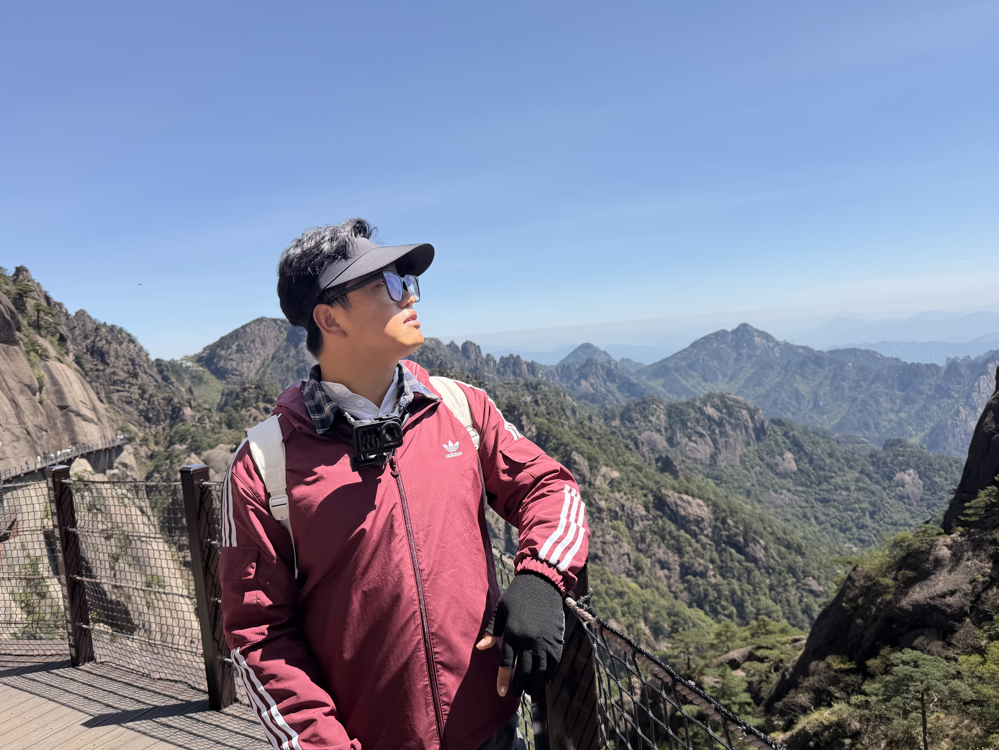

::: {.hero-banner}
:::

::: {.home-about}

::: {.about-top}

::: {.profile-area}

{.profile-photo}

:::

::: {.biography-area}

# Biography

I am a Ph.D. student in Environment at Yale University, working on climate–ecosystem interactions. My research focuses on drought and land–atmosphere interactions, particularly how climate extremes develop and affect terrestrial ecosystems. Beyond research, I enjoy exploring natural landscapes, taking long walks, and spending time in nature.

:::

:::

::: {.about-bottom}

::: {.interests-area}

## Research Interests

- Climate–Ecosystem Interactions
- Drought and Climate Extremes
- Land–Atmosphere Interactions
- Ecosystem Responses
- Hydrological Modeling and Prediction

:::

::: {.education-area}

## Education

**Ph.D. in Environment**  
Yale University                                                | 2026–Present 

**M.S. in Civil and Hydraulic Engineering**  
North China University of Water Resources and Electric Power   |2022–2025  

**B.S. in Water Engineering**  
North China University of Water Resources and Electric Power   |2018–2022

:::

:::

:::